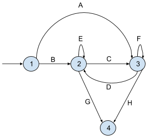

# Игра морской бой (Ethereum)

**Идея**

Разработать игру морской бой с общей логикой реализованной в виде контракта на блокчейн Ethereum. Для взаимодействия с контрактом создать клиент в виде обычного пользовательского приложения. В приложении отображать игровое поле и весь ход игры.

**Правила игры**

Игра для двух участников, в которой игроки по очереди выбирают координаты на неизвестной им карте соперника. Если у соперника по этим координатам имеется корабль (координаты заняты), то корабль или его часть «топится», а попавший получает право сделать ещё один ход. Цель игрока — первым потопить все корабли противника.

Игровое поле - квадрат 10х10
* 1 корабль — 4 клетки `линкор`
* 2 корабля — 3 клетки `крейсер`
* 3 корабля — 2 клетки `эсминец`
* 4 корабля — 1 клетка `торпедный катер`

**Алгоритм реализации ethereum**

* **(A)** Если очередь запросов от пользователей, которые хотят начать новую игру пустая то добавляем текущий запрос в очередь. Переходим в состояние 3 (WAIT_RESP_GAMER_2), ждем пока кто то еще не пришлет запрос и не начнет игру. 
  > В запросе на новую игру пользователь передает координаты расстановки кораблей и координаты своего первого хода. Так же пользователь оплачивает ставку (eth), которая достанется победителю после завершения игры.

* **(B)** Если очередь запросов на игру не пустая, в ней уже есть более ранняя заявка от другого пользователя, начинаем игру. Объединяем игрока из текущего запроса (GAMER_2) с игроком, который уже был в очереди (GAMER_1) в игровую пару. Переходим в состояние 2 (WAIT_RESP_GAMER_1), ждем ответного хода от игрока GAMER_1.

* **(C)** Если GAMER_1 совершил ответный ход переходим в состояние 3 (WAIT_RESP_GAMER_2), ждем ответа от игрока GAMER_2.

* **(D)** Если GAMER_2 совершил ответный ход переходим в состояние 2 (WAIT_RESP_GAMER_1), ждем хода от игрока GAMER_1.

* **(E)** Если GAMER_1 сообщил, что его корабль полностью или частично подбит, остаемся в состояние 2, GAMER_2 может совершить еще один внеочередной ход.

* **(F)** Если GAMER_2 сообщил, что его корабль полностью или частично подбит, остаемся в состояние 3, GAMER_1 может совершить еще один внеочередной ход.

* **(G)** GAMER_2 переходит в в статус 4 (GAME_OVER), если:
  * После очередного хода выиграл игру (потопил все корабли противника) 
    > Общая сумма ставок игроков eth (beat) переводится на счет победителя.
  * Принудительно раньше времени завершил игру (сдался) 
    > На счет победителя переводится только часть ставки проигравшего, остальная сумма возвращается проигравшему.
  * Не отвечал на очередной ход противника больше определенного периода времени
    > На счет победителя переводится только часть ставки проигравшего, остальная сумма возвращается проигравшему.

* **(H)** GAMER_1 переходит в в статус 4 (GAME_OVER), если:
  * После очередного хода выиграл игру (потопил все корабли противника)
  * Принудительно раньше времени завершил игру (сдался) 
  * Не отвечал на очередной ход противника больше определенного периода времени